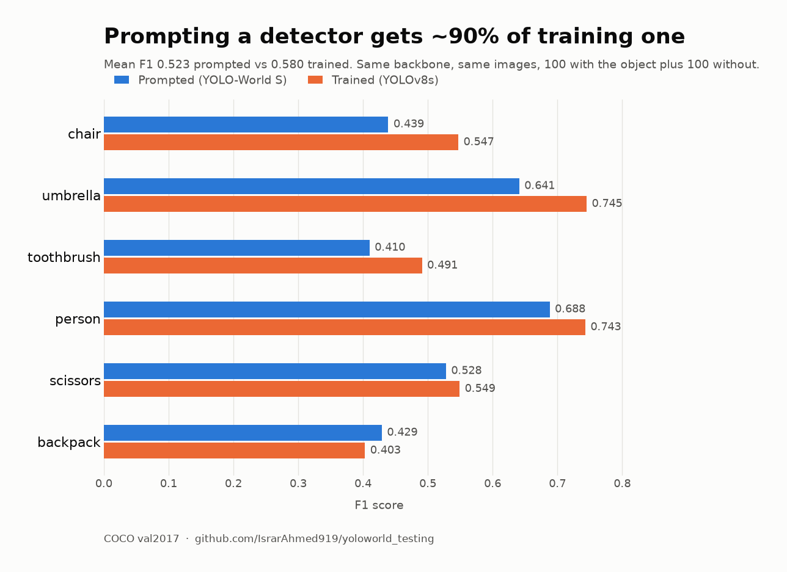

# What does prompting cost you?

Open-vocabulary detectors like YOLO-World detect a class by being told its name. No labelling,
no training, no dataset. The obvious question for anyone shipping a detector is what that
convenience actually costs in accuracy — and it's a question papers rarely answer, because
papers compare against other papers rather than against the practical alternative.

This repo measures it directly: same backbone, same images, same evaluation. One model
prompted, one trained.

> **Result:** on six COCO classes, prompting reaches **90% of a trained detector's F1**
> (0.523 vs 0.580 mean). Training buys about **+0.06 F1** for the cost of labelling a dataset.
> The gap is uneven — some classes gain 0.10, others gain nothing.



---

## Headline comparison

YOLO-World S (prompted, zero-shot) vs YOLOv8s (trained on COCO). Both models share the
YOLOv8s backbone, so the only meaningful difference is prompted versus trained.

| class | prompted F1 | trained F1 | gap |
|---|---|---|---|
| person | 0.688 | 0.743 | +0.056 |
| chair | 0.439 | 0.547 | +0.108 |
| backpack | 0.429 | 0.403 | **−0.026** |
| umbrella | 0.641 | 0.745 | +0.103 |
| scissors | 0.528 | 0.549 | +0.021 |
| toothbrush | 0.410 | 0.491 | +0.081 |
| **mean** | **0.523** | **0.580** | **+0.057** |

Each class evaluated on 100 images containing it plus 100 that don't, at each model's own
optimal threshold. Negative images are included so that false positives on absent objects are
counted honestly — evaluating only on positives would flatter both models.

**What this supports:**

- Prompting retains roughly **90%** of trained performance on these classes
- The gap is **not uniform**. `chair` and `umbrella` gain ~0.10 from training; `backpack` and
  `scissors` gain essentially nothing, and `backpack` is marginally better prompted
- So the useful question is not "prompt or train" but "*which classes actually need training*"

**What this does not support:**

- Six classes is far too few to predict *which* classes benefit. Directional only
- **COCO is home turf for both models.** YOLOv8s was trained on it, and YOLO-World very likely
  saw COCO-like data during pretraining. This is close to open-vocabulary's best case. The
  actual reason to use an open-vocabulary model is to detect things COCO does not contain, and
  this experiment says nothing about that

---

## Setup

| | |
|---|---|
| Prompted | `yolov8s-world.pt` (YOLO-World S) |
| Trained | `yolov8s.pt` (YOLOv8s, COCO) |
| GPU | NVIDIA RTX 4050 Laptop, 6 GB, Ada Lovelace |
| Data | COCO val2017 |
| Matching | greedy, IoU ≥ 0.5, each ground-truth box claimed once |
| Ground truth | `iscrowd` regions excluded |

The 6 GB card is deliberate. Jetson Orin Nano ships with 8 GB shared, so results from
constrained hardware are more representative of edge deployment than datacentre-GPU numbers.

An earlier version of this table compared YOLO-World S against **YOLOv8n**, and prompting
appeared to *beat* training on four of six classes. That was a confound, not a result —
YOLOv8n is roughly a third the size. It is recorded here because it is exactly the kind of
mistake that produces an exciting and wrong headline.

---

## Two hypotheses that did not survive

The project started somewhere else. Both starting hypotheses were tested and refuted, and
they are kept here because the negative results are informative.

### 1. "Each class needs its own confidence threshold" — not supported

The motivating observation came from a webcam: prompting for `person`, `ring`, `headphones`
and `hand` at once, nothing below 0.25 was clean and nothing above 0.25 detected the last two.

Measured properly on COCO, the optimal thresholds cluster:

| class | best conf | | class | best conf |
|---|---|---|---|---|
| person | 0.33 | | scissors | 0.27 |
| chair | 0.25 | | toaster | 0.27 |
| backpack | 0.13 | | toothbrush | 0.25 |
| umbrella | 0.25 | | hair drier | 0.01 |

Six of eight sit between 0.25 and 0.33 — the Ultralytics default of 0.25 is fine. The two
outliers had **9** and **11** ground-truth boxes respectively, which is far too few to mean
anything.

That is itself worth recording: **COCO val2017 is too small for rare-class analysis.** Those
categories have a few dozen instances in the entire 5,000-image set. Rare-class work needs
COCO train2017 or LVIS.

For `person`, the F1 curve is also broad and flat — anything from 0.15 to 0.30 lands within
2.5% of optimal, and the argmax is unstable enough to jump several steps between samples
without F1 meaningfully changing.

### 2. "Optimal threshold depends on class prevalence" — refuted

A plausible follow-up: if a class appears in fewer images, empty images generate false
positives, precision suffers, and the optimal threshold should rise. This matters in
surveillance, where the target event is absent from virtually every frame.

Fixed 100 positive images, varied only the negatives:

| prevalence | best conf | precision | recall | F1 |
|---|---|---|---|---|
| 100.0% (100p/0n) | 0.23 | 0.768 | 0.631 | 0.693 |
| 66.7% (100p/50n) | 0.23 | 0.760 | 0.631 | 0.689 |
| 50.0% (100p/100n) | 0.29 | 0.801 | 0.603 | 0.688 |
| 33.3% (100p/200n) | 0.29 | 0.792 | 0.603 | 0.685 |
| 20.0% (100p/400n) | 0.29 | 0.768 | 0.603 | 0.675 |

Threshold moves 0.23 → 0.29 across a fivefold change in prevalence, and F1 drops 2.6%.
Effectively nothing.

The precision column explains why: it is **0.768 at both ends**. Adding 400 person-free images
produced almost no false positives — YOLO-World does not hallucinate people into empty scenes,
so there is no precision damage for a higher threshold to correct. The proposed mechanism does
not exist.

### A methodological note worth keeping

The first threshold sweep used **mAP**, and produced a curve that fell monotonically from 0.713
to 0.373, which looks like "lower threshold is better."

That is an artifact. Average precision already integrates the full precision-recall curve and
ranks detections internally; filtering by confidence beforehand simply truncates the curve.
The AP-optimal threshold is always ≈ 0, for every class, always. **mAP measures ranking quality,
not the operating point.** Threshold selection needs precision, recall and F1, with the optimum
at the F1 peak.

---

## Repo contents

| File | Purpose |
|---|---|
| `yolo_world_vs_coco.ipynb` | All COCO experiments — harness, sweeps, comparison |
| `yoloworld.py` | Open-vocabulary detection on a live feed, threshold adjustable at runtime |
| `yolo_on_video.py` | Closed-vocabulary YOLOv8 on webcam, for comparison |
| `coco/` | val2017 images and annotations (gitignored) |

`yoloworld.py` supports live threshold sweeping and CSV logging of per-class detection counts:

```bash
python yoloworld.py --classes person ring headphones hand --conf 0.25 --log sweep.csv
# keys:  q quit   +/- adjust threshold   s save frame
```

---

## Reproducing

```bash
pip install ultralytics pycocotools torchmetrics torchvision opencv-python

wget -c http://images.cocodataset.org/zips/val2017.zip
wget -c http://images.cocodataset.org/annotations/annotations_trainval2017.zip
unzip val2017.zip -d coco/ && unzip annotations_trainval2017.zip -d coco/
```

Model weights download automatically on first run and are gitignored.

---

## Next

- [ ] **Classes outside COCO.** The real use case for open-vocabulary detection is objects no
      trained detector covers. Everything above is measured on COCO's home turf, which flatters
      both models. LVIS rare classes are the obvious next dataset
- [ ] More classes, so "which classes benefit from training" becomes a rule rather than an
      observation
- [ ] Prompt sensitivity — does `hair drier` vs `hair dryer` vs `blow dryer` move F1 for
      identical ground truth?
- [ ] Latency and throughput on constrained hardware: FP16, INT8, FP8 (Ada) via TensorRT
- [ ] Multi-stream — where the ceiling sits, and whether it is inference or NVDEC decode

---

## License and attribution

Code in this repo is MIT (see `LICENSE`).

Two things it does not cover:

- **Models** come from [Ultralytics](https://github.com/ultralytics/ultralytics) and ship under
  **AGPL-3.0**, with a commercial licence available as an alternative. If you reuse this work
  in a product, check which applies to you.
- **COCO annotations** are **CC BY 4.0**; the images carry their own individual Flickr terms.
