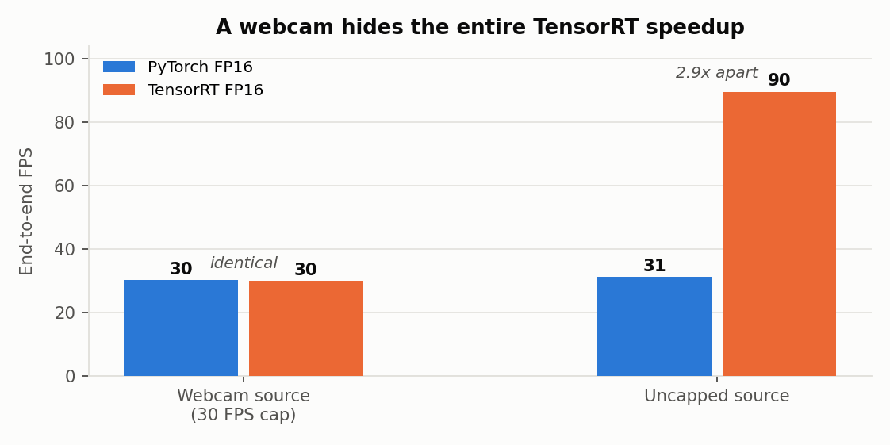
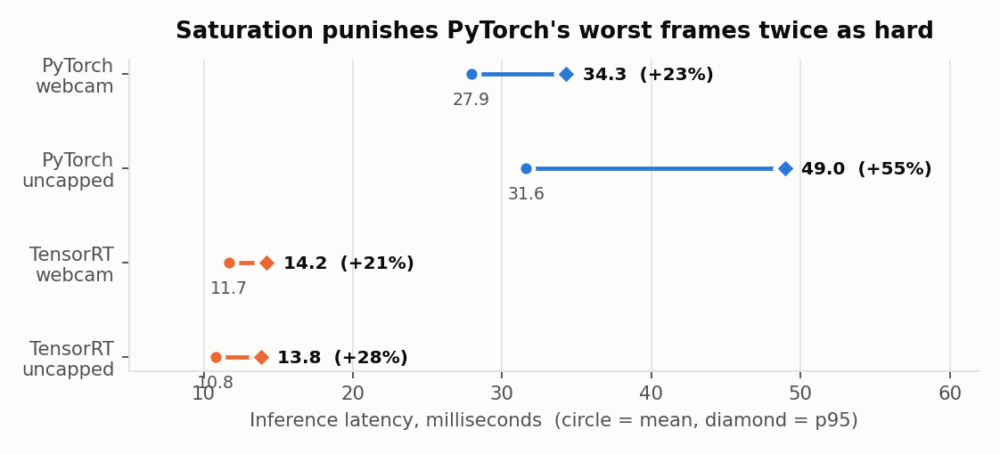
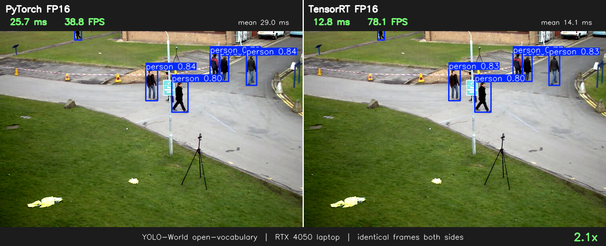
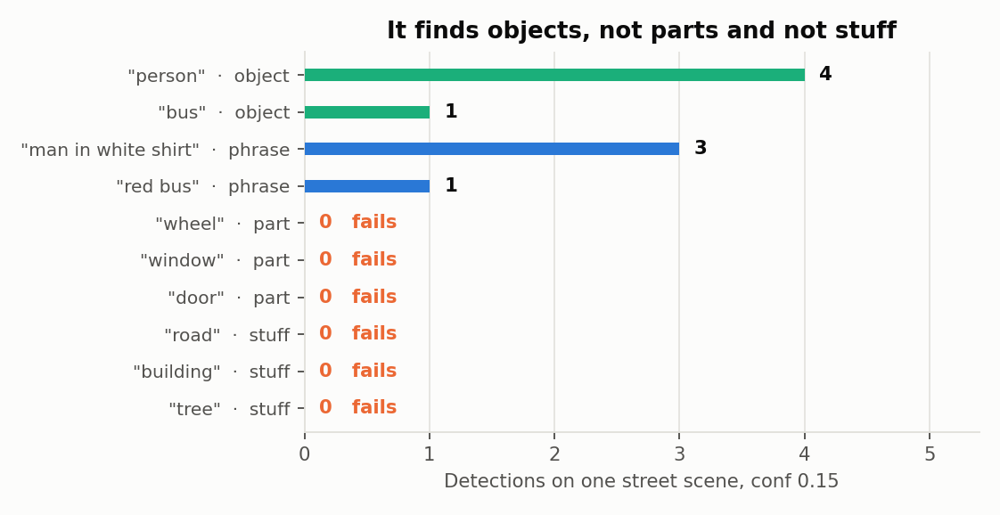
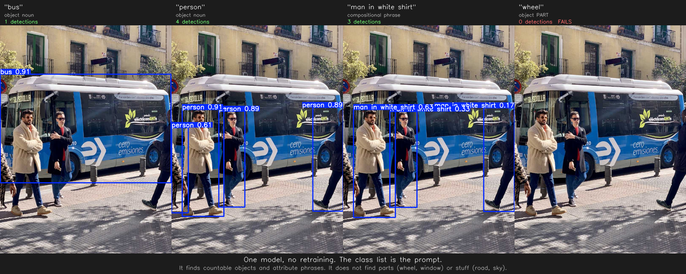
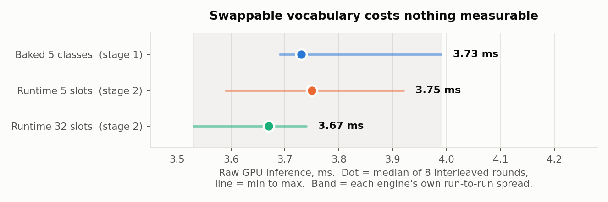
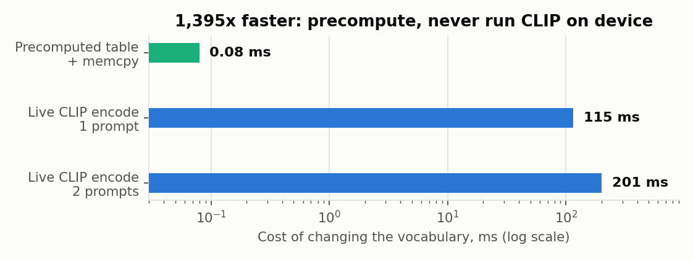
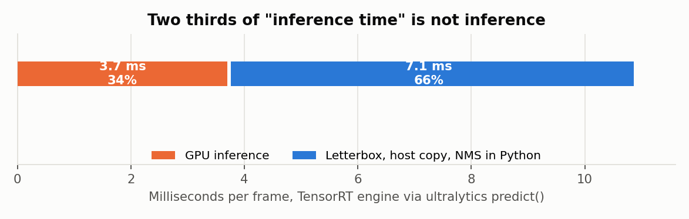

# Open-Vocabulary Detection on TensorRT

### Converting YOLO-World to a real-time engine, and making its vocabulary swappable at runtime

**Israr Ahmed**

---

## Summary

- YOLO-World converted to a TensorRT FP16 engine and benchmarked against PyTorch on live video. **2.9x faster inference**, 10.8 ms against 31.6 ms.
- **A webcam hides that speedup completely.** Both backends deliver 30 FPS end to end, because the camera, not the model, is the bottleneck. Any benchmark run against a webcam measures the webcam.
- A second engine was then built whose **class list is a runtime input** rather than a baked constant, so the vocabulary changes between frames instead of requiring a 393 second rebuild.
- **Making the vocabulary swappable costs nothing measurable.** 3.75 ms against 3.73 ms baked, a 0.6% difference inside a 9% noise floor. There is no performance argument for baking it.
- **Never run the text encoder on the device.** Live CLIP encoding costs 115 ms per prompt. A precomputed embedding table costs 0.08 ms. That is 1,395x, and it removes the text encoder from the deployment entirely.
- **Two thirds of what gets quoted as "inference time" is not inference.** Raw GPU execution is 3.7 ms; the same engine through a standard Python wrapper measures 10.8 ms. The rest is letterboxing, host transfer and NMS.
- Open vocabulary detects countable objects and attribute phrases. It **fails on object parts and on amorphous regions**: wheel, window, door, road, building and tree all return nothing at any threshold.

---

## 1. Hardware and software

| | |
|---|---|
| GPU | NVIDIA RTX 4050 Laptop, 6 GB |
| Driver | 570.172.08 |
| CUDA | 12.4 |
| TensorRT | 10.16.1.11 (`tensorrt-cu12`) |
| PyTorch | 2.7.1+cu126 |
| ultralytics | 8.4.115 |
| OS | Ubuntu 24.04.1 LTS |
| Model | `yolov8s-worldv2`, FP16, 640px |
| Test footage | Fixed-camera pedestrian scene, 768x576, and a street scene still |

All timings are 150 to 480 measured frames after a discarded warmup. Test assets are committed to the repository so every number can be reproduced.

---

## 2. Converting YOLO-World to TensorRT

Three lines do the conversion, but the middle one is the entire trick.

```python
model = YOLOWorld("yolov8s-worldv2.pt")
model.set_classes(["person", "backpack", "cell phone", "bottle", "chair"])
model.export(format="engine", half=True, imgsz=640, device=0)
```

### Why `set_classes()` is what makes export possible

- YOLO-World normally takes text **at inference time**. It runs prompts through a CLIP text encoder and compares the resulting embeddings against image region features.
- A text encoder plus variable-length string input cannot be compiled into a static engine.
- `set_classes()` runs CLIP **once, offline**, then folds the embeddings into the model as fixed weights. This is reparameterization.
- After it, the network is architecturally a YOLOv8 with a hardcoded 5-class head. No text path remains.

### The exported graph proves it

Inspecting the ONNX:

```
inputs:   images  [1, 3, 640, 640]     <- image only, no text input
outputs:  output0 [1, 9, 8400]         <- 9 = 4 box coords + 5 classes
text/CLIP nodes remaining: 0
```

- `8400` is the anchor count: 80² + 40² + 20² across three detection scales.
- The `9` is the giveaway. The vocabulary size has become part of the tensor shape.

The embeddings themselves are visible as baked constants feeding the Einsum nodes:

```
/model.22/cv4.0/Einsum   runtime x CONSTANT[1, 5, 512]
/model.22/cv4.1/Einsum   runtime x CONSTANT[1, 5, 512]
/model.22/cv4.2/Einsum   runtime x CONSTANT[1, 5, 512]
/model.12/attn/Einsum    runtime x CONSTANT[1, 5, 4, 32]
```

- The three `cv4` constants are the contrastive detection heads, one per scale, holding five 512-dimensional CLIP embeddings.
- The `attn` constants are the text-guided attention blocks, the same embeddings projected and reshaped into heads.
- Their names end in `Div_output_0`. They were originally *computed* nodes, the L2 normalisation of the embeddings. Constant folding collapsed them because their inputs were constant. The text encoder was not removed by hand; it folded away.

### The conversion pipeline

| step | time | output |
|---|---|---|
| PyTorch to ONNX | 4.6 s | 47.8 MB |
| ONNX to TensorRT FP16 | **393 s** | 27.0 MB |

- The 393 seconds is TensorRT timing multiple kernel implementations for every layer against this specific GPU and selecting the fastest.
- That is why the engine is faster, and also why it is **not portable**. It is compiled for this GPU at this TensorRT version and will not load elsewhere.

### Setup gotcha worth an hour

- `pip install tensorrt` currently resolves to the 11.x build, which is compiled against CUDA 13 and needs driver r580 or newer.
- Ubuntu 24.04 ships driver 570. The failure surfaces confusingly:

```
cudaError 35: CUDA driver version is insufficient for CUDA runtime version
TypeError: pybind11::init(): factory function returned nullptr
```

- Fix: pin the CUDA 12 line with `pip install "tensorrt-cu12>=10.0,<11"`.

---

## 3. Benchmarking: the two numbers that are not the same thing

The harness reports both deliberately:

- **Inference time**: how long the model takes on one frame.
- **End-to-end FPS**: what the stream actually delivers, including capture, letterbox, NMS and draw.

Quoting the first as if it were the second is the most common error in edge-CV demos. A model that infers in 6 ms does not give you 166 FPS.

### A webcam hides the entire speedup



| | webcam-capped | uncapped |
|---|---|---|
| PyTorch FP16 | 27.94 ms, p95 34.28, **30.1 FPS** | 31.61 ms, p95 48.95, **31.3 FPS** |
| TensorRT FP16 | 11.70 ms, p95 14.20, **30.0 FPS** | 10.80 ms, p95 13.82, **89.5 FPS** |

- On a webcam both backends read 30 FPS. Identical. A 2.9x reduction in inference time is invisible.
- `cap.read()` blocks until the camera produces the next frame, and the camera runs at 30 Hz regardless of model speed.
- The model was already faster than the camera, so what TensorRT actually buys is **headroom**, not frame rate. That is the difference between one stream and three on the same GPU.

### The tail matters more than the mean



- Under saturation PyTorch's worst frames degrade **+55%** above its mean; TensorRT's only **+28%**.
- The direction of change differs too. Saturating PyTorch made it *slower* (27.94 to 31.61 ms). Saturating TensorRT made it *faster* (11.70 to 10.80 ms), because back-to-back execution keeps clocks warm and avoids per-call setup.
- For a deployment judged on dropped frames rather than average throughput, that predictability is worth more than the 2.9x.

### Benchmark variance on a laptop GPU

- Three runs of the same comparison gave speedups of **2.93x, 2.39x and 2.06x**.
- PyTorch's mean on identical input moved from 40.0 ms to 29.0 ms between consecutive runs, a 27% swing from clock and thermal state alone.
- Quote a range or a median across runs. A single laptop figure is not reproducible, including by the person who published it.

### Side-by-side output



Recorded once and processed twice through the same frames, so the comparison is fair. Running both models live would halve each one's throughput and the overlaid FPS would be a number neither backend achieves.

---

## 4. What open vocabulary actually covers

Same weights, no retraining, only the prompt changes.





| prompt | detections | note |
|---|---|---|
| `person` | 4 @ 0.91 | countable object, works |
| `bus` | 1 @ 0.91 | countable object, works |
| `man in white shirt` | 3 @ 0.63 | compositional phrase, works with a caveat |
| `red bus` | 1 @ 0.30 | attribute costs two thirds of the confidence |
| `wheel`, `window`, `door` | 0 | object **parts** are not found |
| `road`, `building`, `tree` | 0 | amorphous **stuff** is not found |

Two things to know before promising this to a client:

- **It detects things, not stuff.** Countable objects work. Regions such as road, sky and building return nothing at any threshold. That is a detector behaving as a detector, but it surprises people who expect a vision-language model to find anything they can name.
- **Attribute phrases bias ranking, they do not filter.** `man in white shirt` scored the correct person at 0.63 but still fired on two others at 0.33 and 0.17. Useful for ordering candidates, not reliable as a filter without a per-prompt threshold.

That second point matches the earlier finding in this repository: the usable confidence threshold is a property of the prompt, not of the model.

---

## 5. Stage 2: making the vocabulary a runtime input

Stage 1's engine is fast and frozen. Changing one word costs 393 seconds. Stage 2 removes that.

### The approach, and why no graph surgery is needed

- `WorldModel.predict()` **already accepts** `txt_feats` and threads it to `C2fAttn`, `ImagePoolingAttn` and `WorldDetect`.
- The embeddings only became constants because `torch.onnx.export` traced a single image input.
- Wrapping the call in a Module that takes both tensors keeps every internal text projection inside the graph:

```python
class DualInputWorld(torch.nn.Module):
    def __init__(self, world_model, slots):
        super().__init__()
        self.m = world_model
        head = self.m.model[-1]
        head.nc = slots
        head.export = True

    def forward(self, images, txt_feats):
        return self.m.predict(images, txt_feats=txt_feats)
```

Resulting graph:

```
inputs:   images     [1, 3, 640, 640]
          txt_feats  [1, 32, 512]      <- the vocabulary, now an input
outputs:  output0    [1, 36, 8400]     <- 4 + 32 slots
```

Verified rather than assumed. In stage 1 all seven Einsum nodes read `CONSTANT[1, 5, 512]`. Here all seven read `live x live`, with zero baked 512-dimensional constants remaining.

### Why the slot count is fixed rather than dynamic

`WorldDetect.forward` ends with:

```python
boxes, scores = x_cat.split((self.reg_max * 4, self.nc), 1)
```

- `self.nc` is a Python int read at trace time, so the split size is baked into the graph.
- A truly dynamic class axis would require that split to be dynamic, which is fragile in TensorRT.
- The workaround is a **fixed slot count with zero padding**.

Padding is safe, and this is checkable rather than hopeful. `BNContrastiveHead` computes:

```
normalize(w) -> einsum -> x * logit_scale.exp() + bias
```

- On the trained checkpoint those biases are **-11.95, -10.41 and -8.87**.
- A zero embedding therefore scores `sigmoid(bias)`, about 1e-4.
- Across every test run, no padded slot ever fired.

### It works

| prompt | detections |
|---|---|
| `bus` | bus 0.90 |
| `person` | 4 people: 0.91, 0.89, 0.88, 0.74 |
| `bus`, `person` | 5 boxes, both classes at once |
| `man in white shirt` | 0.60, 0.46 |
| `dog` | nothing, correctly |

Same engine, same session, no rebuild between any of those rows.

### Swappability is free

Three engines so the two variables separate:

- **baked-5**: stage 1, embeddings folded into weights.
- **dyn-5**: same 5 classes, same `[1, 9, 8400]` output, but `txt_feats` is an input. Comparing this to baked-5 isolates the cost of swappability.
- **dyn-32**: 32 slots. Comparing to dyn-5 isolates the cost of extra slots.

Measured interleaved round-robin, 8 rounds of 60 frames each, so thermal drift hits all three equally. Raw GPU inference only.



| engine | median | min | max | own spread |
|---|---|---|---|---|
| baked 5 classes | 3.73 ms | 3.69 | 3.99 | 8.1% |
| runtime 5 slots | 3.75 ms | 3.59 | 3.92 | 9.0% |
| runtime 32 slots | 3.67 ms | 3.53 | 3.74 | 6.0% |

- Cost of swappability: **+0.6%**.
- Cost of 32 slots instead of 5: **-2.2%**.
- Both sit far inside the 9% each engine varies by on its own. Neither effect is measurable on this hardware.
- Physically this is expected. The image backbone pushes 640x640x3 through 68 convolutions. The text path is 32x512 through a handful of linear layers and seven Einsums. It vanishes into the noise.
- **Conclusion: there is no performance reason to bake the vocabulary.** Stage 1's design buys nothing and costs 393 seconds per change.
- Caveat stated honestly: on a Jetson Nano the text path is a larger share of a smaller budget, so this should be re-measured there rather than assumed.

### Do not run CLIP on the device



| method | cost |
|---|---|
| Live CLIP encode, 1 prompt | 115.41 ms |
| Live CLIP encode, 2 prompts | 200.61 ms |
| Precomputed table plus memcpy | **0.08 ms** |

- **1,395x.** Live encoding also scales with prompt count, so a five-word change stalls a 30 FPS pipeline for the better part of a second.
- One embedding is 512 float32 values, so **2 KB**. A 10,000 word vocabulary is a **20 MB** lookup table built offline and shipped with the model.
- That is nothing on a Jetson, and it means **no text encoder needs to exist on the device**.

---

## 6. Where the time actually goes



- Raw GPU execution: **3.7 ms**, about 270 FPS.
- The same engine through ultralytics' `predict()`: **10.8 ms**.
- The missing 7.1 ms is letterboxing, the host transfer, and NMS on a `[1, 36, 8400]` tensor in Python.
- So when a benchmark quotes 10 ms for TensorRT YOLO, roughly **two thirds of it is not the model**. If you need more throughput, the model is not where the time is.

### Loading an ultralytics engine with raw TensorRT

- Ultralytics prepends its own metadata to `.engine` files: a 4-byte little-endian length, then a JSON blob.
- On the stage 1 engine that header is **614 bytes** and contains the class names `set_classes()` baked in. That is how `YOLO(engine)` recovers the vocabulary.
- A bare `trt.Runtime` reads the length as a magic tag and fails:

```
Serialization assertion header.magicTag == kEXPECTED_MAGIC_TAG failed
(614 != 1953657958)
```

- Engines built directly with the TensorRT API start with `ftrt` and load without special handling.

---

## 7. Method notes: three surprises that came from the measurement, not the system

Worth recording, because in each case the naive reading was wrong.

- **Box counts appeared to differ between backends.** PyTorch showed 1.00 detections per frame, TensorRT 1.92, which would have invalidated any speed comparison. The cause was the uncapped benchmark grabbing a fresh seed frame per invocation, so the two backends were never scored on the same scene. Given one fixed frame they agree exactly at every threshold, differing only in confidence (0.845 against 0.927) as expected from FP16.
- **The 32-slot engine first measured 12% faster than the 5-slot one.** Physically impossible, since 32 slots computes strictly more work. That impossibility is what proved the spread was noise, and it is why the final numbers are interleaved. A single sequential pass would have produced a confident and wrong number in either direction.
- **The first chart of the swappability result used a truncated y-axis**, which visually exaggerated a difference the report argues is meaningless. Bars encode area and need a zero baseline; the finding is now drawn as a dot plot, where position encoding makes a non-zero axis legitimate.

---

## 8. Reproducing everything

```bash
pip install -r requirements.txt

# stage 1: baked vocabulary
python bench_live.py --export
python bench_live.py --backend torch  --source 0 --no-show --synthetic
python bench_live.py --backend engine --source 0 --no-show --synthetic
python bench_live.py --backend engine --source 0 --no-show

# stage 2: runtime vocabulary
python export_dynamic.py --slots 32
python build_engine.py
python prompt_engine.py --image assets/bus.jpg
python measure_stage2.py

# assets and figures
python make_demo.py --source assets/vtest.avi --max-frames 250 --out-fps 12
python make_charts.py
```

| file | what it does |
|---|---|
| `bench_live.py` | Stage 1 benchmark, both FPS definitions, capped and uncapped |
| `export_dynamic.py` | Dual-input ONNX export, vocabulary as a runtime tensor |
| `build_engine.py` | TensorRT build via the API, since ultralytics cannot do two inputs |
| `prompt_engine.py` | Runtime: swap prompts, no rebuild |
| `measure_stage2.py` | Interleaved three-engine comparison and swap costs |
| `make_demo.py` | Side-by-side video and portfolio stills |
| `make_charts.py` | Every figure in this report |

`prompt_engine.py` uses torch CUDA tensors for device memory, so `.data_ptr()` feeds `set_tensor_address` directly and pycuda is not a dependency.

---

## 9. What this enables

The original plan for the next stage was to convert a language model to TensorRT and wire it into DeepStream so a spoken word could change what the pipeline detects. The measurements above make most of that unnecessary.

- The vocabulary path is a **2 KB memcpy costing 0.08 ms**.
- Embeddings can be precomputed offline into a small lookup table, so **no text encoder and no language model has to run inside the video pipeline**.
- A language model can sit anywhere, emit class names, and the pipeline does a dictionary lookup between frames. The video path never pauses.

What remains is producing the word list and wiring the control path, which is a much smaller problem than compiling a transformer for the edge.
